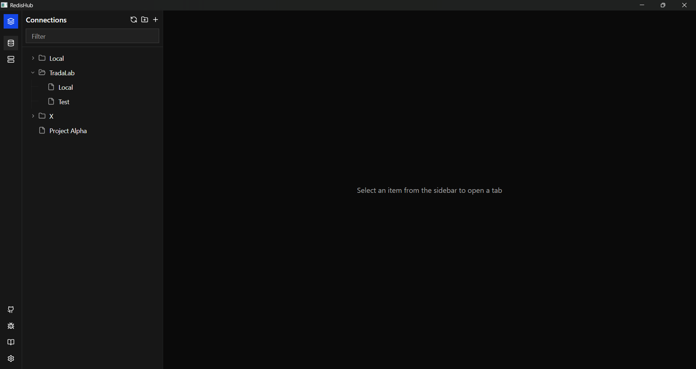
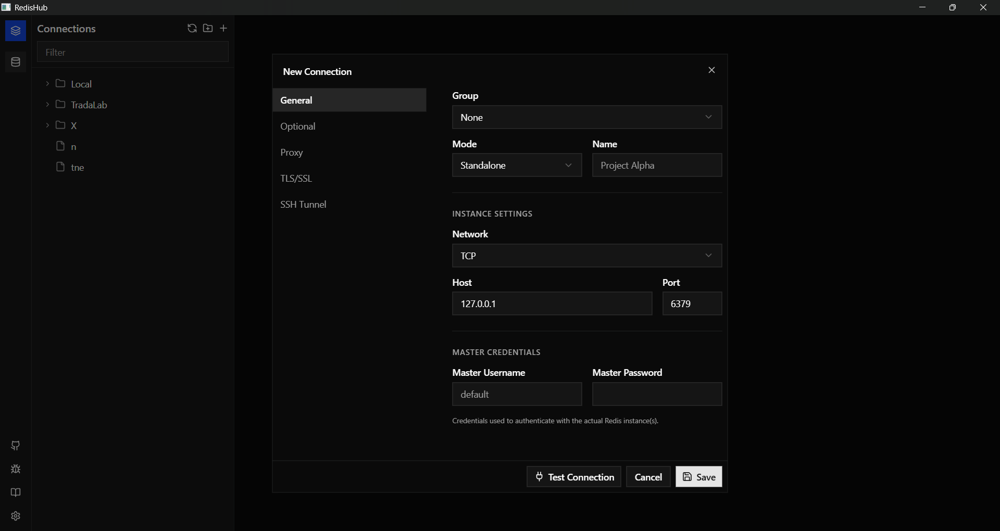
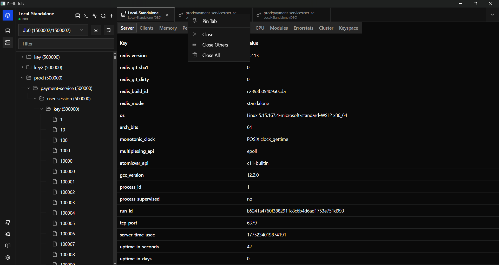

# RedisHub

RedisHub is a powerful, professional command center for the Redis ecosystem. Built for performance and reliability, it is available as a **Native Desktop Client** for Windows, macOS, and Linux, or as a **Centralized Web Application** for teams.

## 📺 Showcase


### Key Screenshots

| Dashboard                                        | Connection Settings | Tab Management |
|--------------------------------------------------|--------------------|----------------|
|  |  |  |

## Key Features

- **Hybrid Platform Support**: Use it as a native desktop application or deploy it as a central web server for team collaboration.
- **Multi-Tab Interface**: Navigate multiple connections and tasks simultaneously.
- **Enhanced Tab Management**: Pin important connections and use bulk closing actions (Close All, Close Others).
- **Proxy Support**: Connect securely through HTTP and SOCKS5 proxies.
- **Advanced Topology Discovery**: Automatic node discovery for Sentinel and Cluster setups.
- **Sentinel Master Credentials**: Support for separate credentials between Sentinel and Master nodes.
- **Dynamic SSH Tunneling**: Reach internal nodes through a single gateway with one-click setup.
- **Monitor & Debugging**: Real-time command streaming with the **Monitor** tool and **Pub/Sub** pattern matching.
- **Improved Command Palette**: Advanced console with command suggestions, history, and dangerous command warnings.
- **UI Customization**: **Compact Mode** for high-density layouts and multi-theme support.
- **Bulk Operations**: Efficient **Bulk Delete** by prefix to manage large-scale data.
- **High Performance**: Optimized for browsing and searching databases with 500k+ keys.
- **Universal Support**: Native binaries for Windows, macOS (Universal), and Linux.

---

## Development Guide

### Prerequisites

| Tool | Version | Notes |
|------|---------|-------|
| **Go** | 1.26+ | `go version` |
| **Node.js** | 22+ | `node -v` |
| **pnpm** | 10.3+ | `pnpm -v` |
| **Docker** | any recent | needed only for local Redis instances |
| **scorix CLI** | latest | `go install github.com/tradalab/scorix/cmd/scorix@latest` (drives `make dev/generate/build/package`) |

> **No C compiler required.** RedisHub is pure Go — SQLite is `modernc.org/sqlite` (no CGO) and the
> webview is driven natively per-OS through `purego` (WebView2 COM on Windows, WKWebView on macOS,
> WebKitGTK on Linux). There is no `gcc`/CGO build step.

**Runtime dependencies** (the app loads these at startup, they are not build deps):

- **Windows** — [WebView2 Evergreen Runtime](https://developer.microsoft.com/microsoft-edge/webview2/) (preinstalled on Windows 11 / recent Windows 10).
- **Linux** — `libgtk-3` and `libwebkit2gtk-4.1` (falls back to `4.0`): `sudo apt-get install -y libgtk-3-0 libwebkit2gtk-4.1-0`.
- **macOS** — none; WKWebView ships with the OS. (Building a universal `.dmg` needs Xcode Command Line Tools for `lipo`.)

Run `make doctor` (`scorix doctor`) to check your toolchain.

---

### 1. Clone & install dependencies

```bash
git clone https://github.com/tradalab/redishub.git
cd redishub
make deps
```

---

### 2. Start a local Redis instance

```bash
make redis-up
```

This starts all three topologies via Docker:

| Service | Port |
|---------|------|
| Standalone | `6001` |
| Master (Sentinel) | `8001` |
| Replica (Sentinel) | `8002` |
| Sentinel | `9001` |
| Cluster node 1 | `7001` |
| Cluster node 2 | `7002` |
| Cluster node 3 | `7003` |

For the cluster, run this once after `redis-up`:
```bash
make redis-init-cluster
```

---

### 3. Run in development mode

```bash
make dev
```

This runs `scorix dev`: it starts the Next.js dev server with hot-reload (HMR) and the Go backend
together, then opens the app window. Frontend edits reload live; IPC calls to the Go backend work
end-to-end (unlike a standalone `pnpm dev`).

---

### 4. Project layout

```
redishub/
├── main.go                  # Entry point — wires app + browser/updater modules; mode app|web
├── scorix.yaml              # Single config source: build recipe + runtime manifest (app, window, logger, modules)
├── proto/app.proto          # IPC contract — handlers, types & events are generated from here
├── etc/schema.sql           # DB schema — sqlx CRUD models are generated from here
├── internal/
│   ├── handler/             # Generated IPC registration (handler.go — DO NOT EDIT)
│   ├── types/               # Generated request/response/event types (DO NOT EDIT)
│   ├── logic/
│   │   ├── client/          # Connection + key operations
│   │   ├── key/             # Per-type key operations (hash, list, set, zset, stream)
│   │   ├── connection/      # Saved connection CRUD
│   │   ├── conn/            # Connection test logic
│   │   ├── console/ monitor/ pubsub/  # Console exec, MONITOR stream, Pub/Sub
│   │   ├── ssh/ tls/ proxy/ # SSH / TLS / proxy profile CRUD + tests
│   │   ├── group/ setting/  # Connection groups & user settings
│   │   └── system/          # System info
│   ├── model/               # Generated sqlx models + secrets handling (modernc/sqlite)
│   ├── svc/                 # Service context + Redis client manager
│   └── config/              # Config struct (embeds scorix config)
├── pkg/
│   ├── netx/                # SSH tunnel + proxy dialers
│   └── util/                # Binary key encoding
├── shell/                   # Next.js frontend (pnpm workspace) → built into .scorix/dist
├── doc/                     # Nextra documentation site
├── dev/                     # Docker Compose files for local Redis
├── scripts/                 # release.sh — version bump helper
└── docker/                  # Dockerfile_web — web/server image (CI builds & pushes it)
```

---

### 5. Adding a new IPC command

IPC is **proto-driven**. Commands follow the pattern `service:method` (e.g. `client:connect`,
emitted as `client:Connect`). `internal/handler/handler.go` and `internal/types/types.go` are
**generated** — you don't edit them by hand.

**Step 1 — Declare the contract** in [`proto/app.proto`](proto/app.proto). Add request/response
messages and an `rpc` to the relevant `service` (use `returns (stream …)` for server-streaming
commands like `monitor:Start`):
```proto
message MyActionReq {
  string connection_id = 1;
}

service client {
  // ... existing rpcs
  rpc MyAction(MyActionReq) returns (Empty);
}
```

**Step 2 — Regenerate** handlers, types, and (if you touched `etc/schema.sql`) models:
```bash
make generate          # scorix generate proto + scorix generate model
```

**Step 3 — Implement the logic** in `internal/logic/<service>/<action>_logic.go`. The generated
handler calls `client.NewMyActionLogic(ctx, svcCtx).MyAction(req)`:
```go
func (l *MyActionLogic) MyAction(req *types.MyActionReq) (any, error) {
    // ... implementation
    return result, nil
}
```

---

### 6. Commands reference

```bash
make dev                  # Run app with Next.js dev server + HMR (scorix dev) — main workflow
make generate             # Regenerate proto + model code (scorix generate proto/model)
make build                # Single-binary build for the host (scorix build)
make package              # Native installer (msi/dmg/appimage) per scorix.yaml (scorix package)
make deps                 # Install all dependencies (Go + pnpm)
make shell-install        # Install frontend dependencies only
make doctor               # Check the toolchain (scorix doctor)
make test                 # Run Go tests
make lint                 # Lint everything (go vet + eslint)
make lint-go              # go vet only
make redis-up             # Start all Docker Redis instances
make redis-down           # Stop all Docker Redis instances
make redis-init-cluster   # Initialize cluster topology (first time only)
make redis-status         # Show container status
make redis-logs           # Tail container logs
make clean                # Remove build artifacts and dist
```

---

### 7. Troubleshooting

**`//go:embed all:.scorix/dist` fails at build time**
The frontend hasn't been built yet. Use `make dev` / `make build` (the `scorix` CLI builds the shell
into `.scorix/dist` first) rather than a bare `go build`. For `make test`/`make lint`, the Makefile
builds the shell once automatically (see the `_ensure-embed` target).

**App window doesn't open (Windows)**
Make sure the [WebView2 Evergreen Runtime](https://developer.microsoft.com/microsoft-edge/webview2/)
is installed. Set `window.debug: true` in `scorix.yaml` to open DevTools. Logs go to stdout by default.

**App window doesn't open (Linux)**
Install the GTK/WebKit runtime: `sudo apt-get install -y libgtk-3-0 libwebkit2gtk-4.1-0`.

**Redis cluster won't connect**
Run `make redis-init-cluster` after `make redis-up`. The cluster requires one-time initialization.

**Port conflict**
Edit port mappings in `dev/docker-compose-*.yaml` and update connection settings in the app.

---

## Contributors

Thanks goes to these amazing people:

<table align="center">
  <tr>
    <td align="center">
      <a href="https://github.com/atdevten">
        <br />
        <sub><b>atdevten</b></sub>
      </a>
    </td>
    <td align="center">
      <a href="https://github.com/0xtrungnq">
        <br />
        <sub><b>0xtrungnq</b></sub>
      </a>
    </td>
    <td align="center">
      <a href="https://github.com/0xtrada">
        <br />
        <sub><b>0xtrada</b></sub>
      </a>
    </td>
  </tr>
</table>
